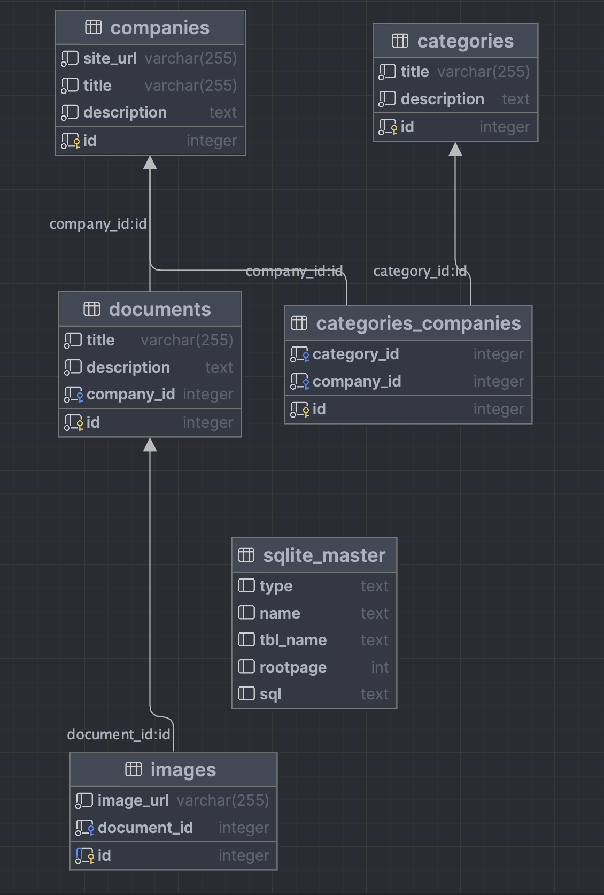

## Start application

```bash
python3 src/main.py
```

### Swagger
http://localhost:8000/swagger#/

### Docs
http://localhost:8000/redoc

1) Create categories.
2) Create comapnies.
3) Create documents with images.
4) Every minute sync_data is run, data from the dev database is synchronized with the prod database.

### Database diagram


